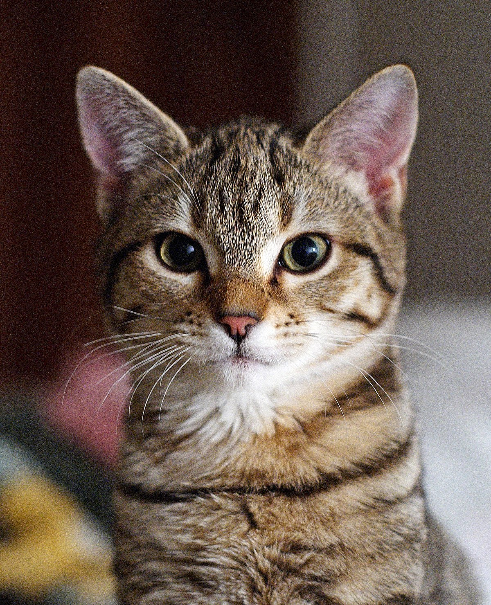

# backgyuwon.cat.io
branch ex
# 홍길동의github홈페이지
## IT 어린이입니다.
파이썬프로그래밍프로젝트입니다. 
## 전체설계도
 
발표동영상입니다.
<iframe width="1280" height="720" src="https://www.youtube.com/embed/9FDkv5LzipA" title="고양이랑 월동 준비 하기" frameborder="0" allow="accelerometer; autoplay; clipboard-write; encrypted-media; gyroscope; picture-in-picture; web-share" referrerpolicy="strict-origin-when-cross-origin" allowfullscreen></iframe>
 ## Reference
 [검색엔진](https://naver.com)
 [Repository1](https://{github-id}.github.io/{repository-name})
